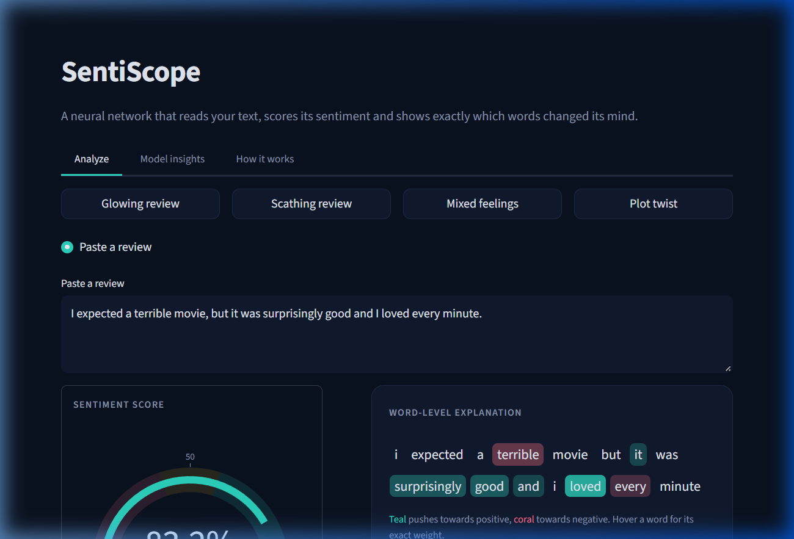
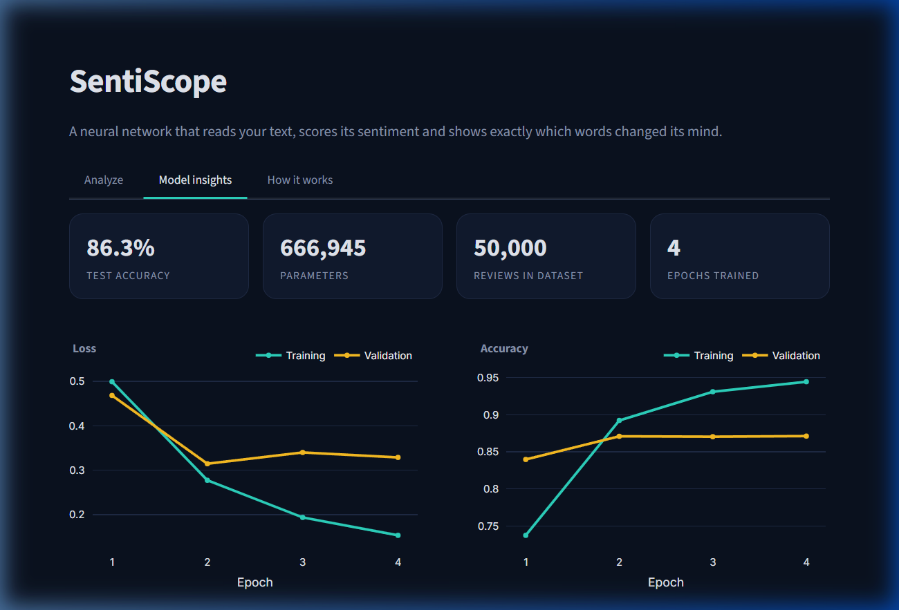
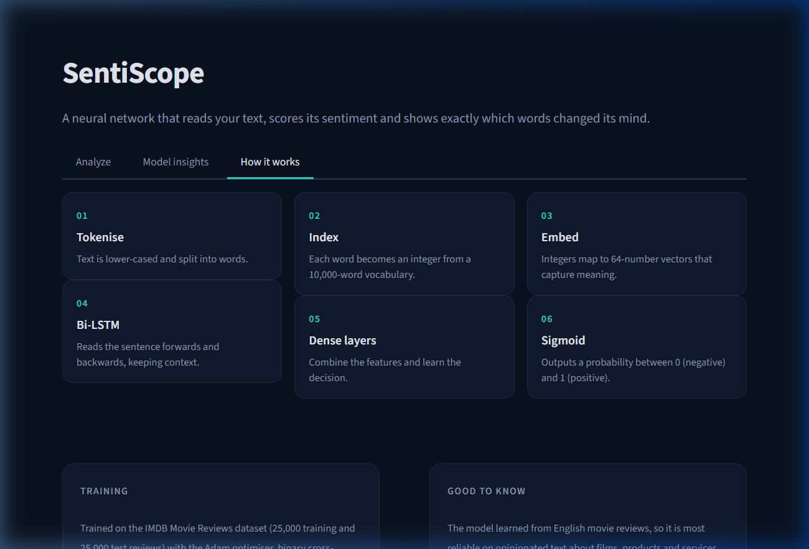

# ◐ SentiScope

> **A neural network that reads your text, scores its sentiment, and shows exactly which words changed its mind.**

SentiScope is a Streamlit web app powered by a Bidirectional LSTM trained on 50,000 IMDB movie reviews. It not only predicts whether a review is positive or negative — it explains *why*, word by word, using occlusion analysis.

---

## 📸 Screenshots

### Analyze Tab


### Model Insights Tab


### How It Works Tab


---

## ✨ Features

- 🎯 **Real-time sentiment scoring** — type a sentence and watch the gauge update live
- 🌈 **Word-level explanations** — teal = pushes positive, coral = pushes negative
- 📊 **Influence chart** — bar chart of the most impactful words
- 🧠 **Model insights** — accuracy, confusion matrix, training history charts
- ⚡ **Auto-trains on first launch** — downloads IMDB dataset and trains the model automatically

---

## 🚀 Quick Start

### 1. Install dependencies
```bash
pip install -r requirements.txt
```

### 2. Run the app
```bash
streamlit run app.py
```

> On first launch, the app will automatically download the IMDB dataset and train the model (~2 minutes). Subsequent launches are instant.

---

## 🏗️ Architecture

```
Input text
    │
    ▼
Tokenize → Index (10k vocab) → Embed (64-dim)
    │
    ▼
Bidirectional LSTM (32 units each direction)
    │
    ▼
Dense (32, ReLU) → Dropout (0.4) → Dense (1, Sigmoid)
    │
    ▼
Sentiment score [0.0 – 1.0]
```

| Layer | Type | Parameters |
|---|---|---|
| Embedding | Embedding | 640,000 |
| BiLSTM | Bidirectional LSTM | 49,408 |
| Dense | Dense + ReLU | 2,080 |
| Output | Dense + Sigmoid | 33 |

---

## 📈 Model Performance

- **Test Accuracy**: ~86%
- **Dataset**: IMDB (25,000 train + 25,000 test reviews)
- **Optimizer**: Adam (lr=1e-3)
- **Loss**: Binary Cross-Entropy
- **Regularization**: Dropout + Early Stopping

---

## 🔍 How Occlusion Analysis Works

Each word is removed one at a time and the network is run again. The shift in its output is that word's influence score. Words are coloured by their influence:
- **Teal** — pushes the prediction toward Positive
- **Coral** — pushes the prediction toward Negative
- **No colour** — negligible influence

This works with *any* model and reflects the network's real behaviour, not an approximation.

---

## 🛠️ Tech Stack

- [Streamlit](https://streamlit.io/) — UI framework
- [TensorFlow / Keras](https://keras.io/) — Neural network
- [Plotly](https://plotly.com/) — Interactive charts
- [NumPy](https://numpy.org/) / [Pandas](https://pandas.pydata.org/) — Data processing

---

## 📁 Project Structure

```
sentiscope/
├── app.py              # Main Streamlit application
├── train.py            # Model training script
├── common.py           # Shared tokenisation & encoding utilities
├── requirements.txt    # Python dependencies
├── .streamlit/
│   └── config.toml     # Streamlit theme config
└── artifacts/          # Trained model + vocab + metrics (auto-generated)
    ├── model.keras
    ├── vocab.json
    └── metrics.json
```
